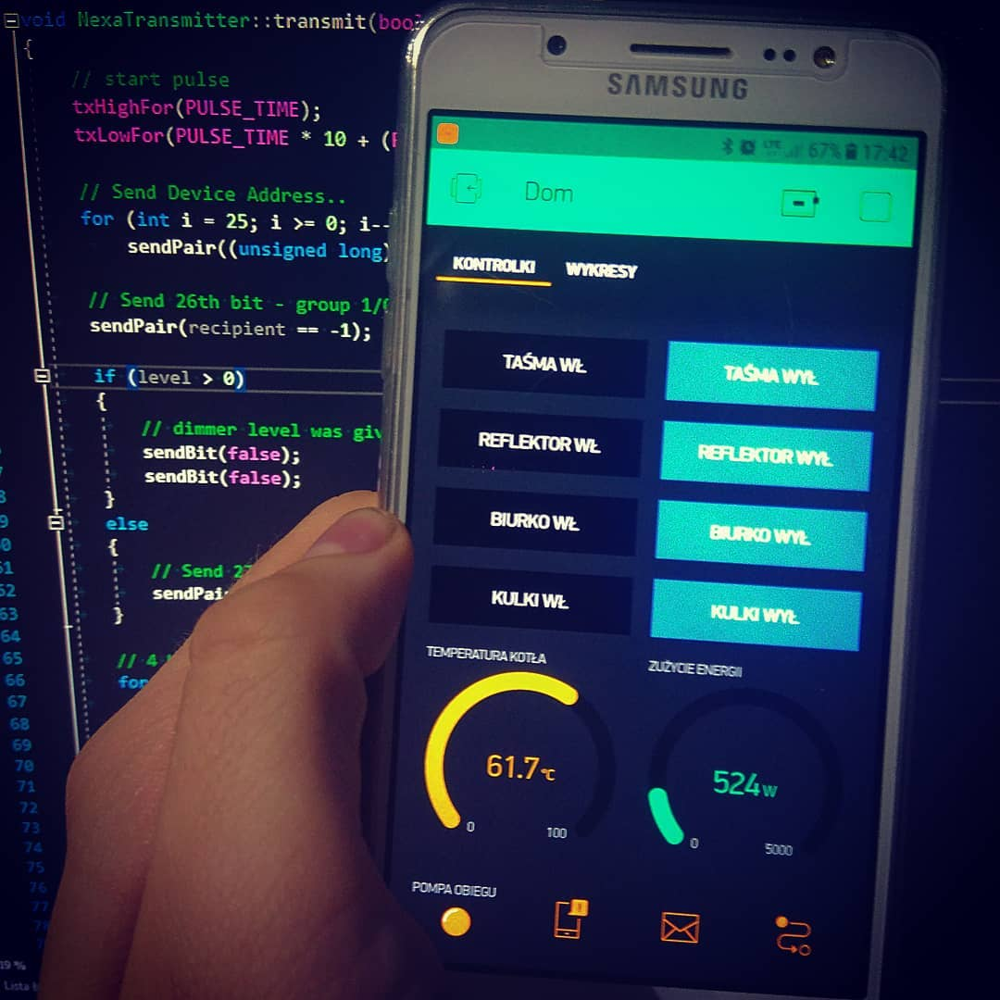

# BlynkMqttBridge

This C# application works as a two-way bridge between MQTT and Blynk App.
By changing configured VPIN value on Blynk, it will be reposted to MQTT server and vice versa.




## Usage example

Linux (using mono):

```sh
mono BlynkMqttBridge.exe -dump
```

Windows:

```sh
BlynkMqttBridge.exe -dump
```
Valid .ini configuration file should be provided in executable directory.
Command line arguments -verbose or -dump might be used to determine debug level.

## Configuration

Example configuration file is provided in bin/Release directory. Application will look for blynkmqttbridge.ini file every run.
Once ran, it loads topics mapping and types. There is a simple mechanism which allows to convert values, for example Blynk LED value is parsed as 0 to 255, but MQTT bool value is almost always defined as 0 or 1. Simply, when MQTT topic has value "1", then "255" will be published on Blynk side and when "255" value is published on that pin, it will repost value "1" to MQTT. This behaviour is defined in TypeEncoder.cs in Application directory.

## Development setup

Simply use Visual Studio 2017 and build provided solution.

## Libraries used by application

[M2Mqtt][m2mqtt] persist here as binary blob. Code can be found at linked repository.

[Ini Library][ini_library] by Larry57

[Blynk Library][blynk_library] by Sverre Frøystein 

<!-- Markdown link & img dfn's -->
[m2mqtt]: https://github.com/eclipse/paho.mqtt.m2mqtt
[blynk_library]: https://github.com/sverrefroy/BlynkLibrary
[ini_library]:https://gist.github.com/Larry57/5725301
